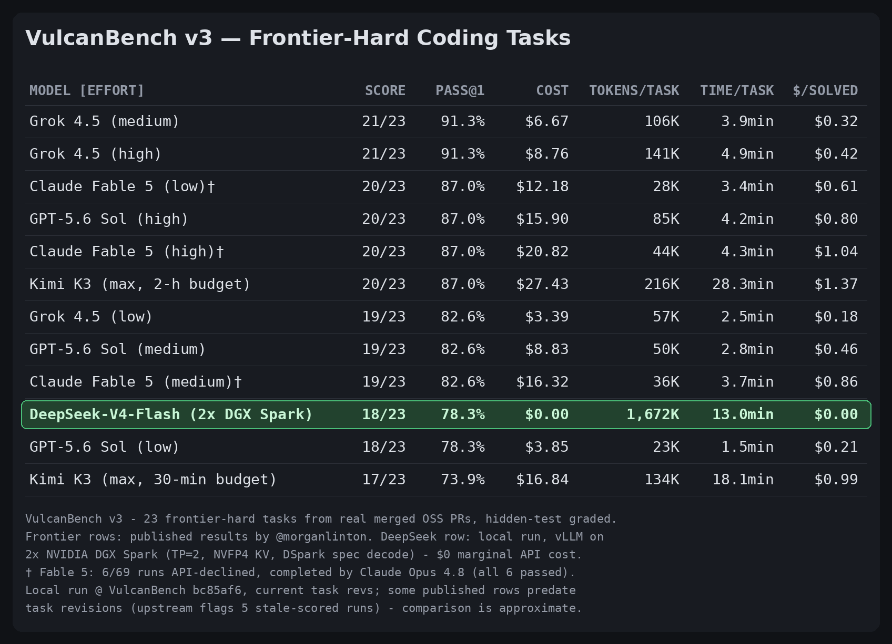

# Benchmark Report: Stock DeepSeek-V4-Flash-DSpark on 2x DGX Spark — VulcanBench

**Model:** `deepseek-ai/DeepSeek-V4-Flash-DSpark` (stock, served as `deepseek-v4-flash-dspark`)
**Server:** vLLM 0.25.2.dev0, TP=2 across 2 nodes, NVFP4 KV, 1M context, DSpark spec decode (see [tool-eval-bench report](../tool-eval/report-2x-dgx-spark-deepseek-v4-flash-dspark-stock-tool-eval.md) for full serving config)
**Hardware:** 2x DGX Spark (GB10, aarch64), master 172.31.100.1:8888
**Benchmark:** [VulcanBench](https://github.com/morganlinton/VulcanBench) v0.6.0 — agentic multi-file SWE tasks in a Docker sandbox
**Config:** OpenAI provider via `OPENAI_BASE_URL`, `--no-judges` (no independent judge model; avoids self-grading), Docker sandbox, 1 repeat
**Date:** 2026-07-20

---

## TL;DR

VulcanBench drives a real tool-calling agent loop (shell commands in a Docker
sandbox, multi-file edits, hidden-test verification) — a step up in realism
from tool-eval-bench's mock tools. On the two suites run:

| Suite | Tasks | pass@1 | Avg total |
|---|---|---|---|
| **v1** (full: Python/Go/TS/Rust, micro→large) | 52 | **0.94 ± 0.03** (49/52) | 0.87 |
| **v1-carbyne** (adversarial: naive solution subtly wrong) | 22 | **0.77 ± 0.09** (17/22) | 0.83 |
| Combined | 74 (75 runs) | 0.89 | 0.86 |

Aggregate five-metric averages: functional 0.89 · **quality 0.93** ·
**security 0.99** · avg 60 steps / ~67K tokens / ~140 s per task.

The failure pattern matches the tool-eval-bench findings precisely: the model
is excellent at breadth (all Go, TS, and Rust tasks pass; oss-ports all pass)
but drops points on **subtle-correctness traps** — concurrency, idempotency,
and ordering invariants where a plausible naive solution passes casual
inspection but fails hidden tests.

## Failures (8 of 75 runs)

| Task | Functional | Steps | Trap |
|---|---|---|---|
| carbyne-idempotent-charge | 0.0 | 28 | Idempotency key semantics |
| carbyne-lru-touch | 0.0 | 48 | LRU access-order update |
| carbyne-publish-lock | 0.0 | 46 | Lock scope / race |
| carbyne-total-order-sort | 0.0 | 60 | Total-order comparator |
| carbyne-atomic-transfer | 0.6 | 52 | Partial: atomicity edge cases |
| py-bytecode-vm | 0.0 | 56 | VM semantics (v1 hard task) |
| py-retry-refactor | 0.0 | 76 | Behavior-preserving refactor |
| py-url-normalize | 0.0 | 132 | URL normalization edge cases |

All 10 Go tasks, all 8 TS tasks, both Rust tasks, and all 12 oss-port tasks
passed. `py-url-normalize` hit 132 steps — the model ruminated rather than
converging, consistent with the multi-turn state-tracking weakness seen in
tool-eval-bench (TC-74).

## Quality / security metrics

- **Quality 0.93 avg** (75/75 scored): mostly 1.0; `go-ttl-lru-cache` and
  `oss-go-metrics-labels` scored 0.5 on real `gofmt`/`go vet` findings.
- **Security 0.99 avg** (67/75 scored): no findings from bandit/gosec on any
  passing run. 8 TS tasks are unscoreable by design (`npm audit` needs a
  `package.json`, which those workspaces don't have).
- Human-like: not scored (`--no-judges`).

## Running VulcanBench against a local vLLM endpoint — notes

Things that needed fixing on the way; all generic to local/ARM setups:

1. **Endpoint wiring is trivial:** the OpenAI provider honors
   `OPENAI_BASE_URL`, so `export OPENAI_BASE_URL=http://172.31.100.1:8888/v1`,
   a dummy `OPENAI_API_KEY`, and `--model openai:deepseek-v4-flash-dspark`
   is all it takes. Add the model to `pricing.local.json` at `$0` to silence
   unknown-cost warnings.
2. **Sandbox images pin an amd64 digest.** On aarch64 the build fails with
   `exec format error`. Fix: strip the `@sha256:...` digest from the `FROM`
   line in `sandbox/Dockerfile.base` (it's a multi-arch tag underneath) and
   build both images: base + `sandbox/Dockerfile.rust`.
3. **Rust tasks error without the Rust image** — build
   `vulcanbench/sandbox:rust` up front, then `--only-missing` fills the gap
   without re-running the other 50 tasks.
4. **Quality/security analyzers run on the HOST, not in the sandbox.**
   `gofmt`/`go vet`/`gosec` missing from the host PATH silently yields
   `quality=None`/`security=None` for all Go tasks (warnings are easy to
   miss at `--max-concurrency 4`). Fix: install Go (user-local works:
   `~/.local/go-toolchain`) and `go install .../gosec@latest`, then re-score.
   `vulcanbench regrade` only redoes *functional* scoring; re-running the
   quality/security analyzers required a small script that rebuilds each
   workspace from task base + `final.patch` and calls the harness's own
   `assess_quality`/`assess_security`/`score_run` — zero model calls,
   21 runs rescored in place.

## Caveats

- **Single repeat** — error bars are cross-task, not cross-run; carbyne's
  ±0.09 is wide. `--repeat 3` would firm up pass@k.
- **No judge model** — human_like unscored, and the diamond tier (rubric-graded
  mergeability) was skipped since grading with the same model under test would
  be self-grading.
- Two v1 tasks (`oss-click-choice-brackets`, `oss-inflection-titleize`) are
  flagged non-decontaminated by the harness (public sources predating training
  cutoffs). Both passed; treat with care.
- The harness's model-separation analysis is vacuous with one real model in
  the store — it needs a second model column to say anything.

## v3 frontier-hard tier — head-to-head with published frontier results

_Added 2026-07-21._ VulcanBench v3 is the 23-task frontier-hard suite (real
merged post-cutoff OSS PRs across Python/Rust/TS/JS/Go, each screened to
defeat low-effort frontier models) — the same suite behind the publicly
posted VulcanBench leaderboard. Running it locally puts our row on the same
suite and grading as the published frontier numbers (comparability caveats
below):



| MODEL [EFFORT] | SCORE | PASS@1 | COST | TOKENS/TASK | TIME/TASK | $/SOLVED |
|---|---|---|---|---|---|---|
| Grok 4.5 (medium) | 21/23 | 91.3% | $6.67 | 106K | 3.9min | $0.32 |
| Grok 4.5 (high) | 21/23 | 91.3% | $8.76 | 141K | 4.9min | $0.42 |
| Claude Fable 5 (low)† | 20/23 | 87.0% | $12.18 | 28K | 3.4min | $0.61 |
| GPT-5.6 Sol (high) | 20/23 | 87.0% | $15.90 | 85K | 4.2min | $0.80 |
| Claude Fable 5 (high)† | 20/23 | 87.0% | $20.82 | 44K | 4.3min | $1.04 |
| Kimi K3 (max, 2-h budget) | 20/23 | 87.0% | $27.43 | 216K | 28.3min | $1.37 |
| Grok 4.5 (low) | 19/23 | 82.6% | $3.39 | 57K | 2.5min | $0.18 |
| GPT-5.6 Sol (medium) | 19/23 | 82.6% | $8.83 | 50K | 2.8min | $0.46 |
| Claude Fable 5 (medium)† | 19/23 | 82.6% | $16.32 | 36K | 3.7min | $0.86 |
| **DeepSeek-V4-Flash-DSpark (local, 2x DGX Spark)** | **18/23** | **78.3%** | **$0.00** | **1,672K** | **13.0min** | **$0.00** |
| GPT-5.6 Sol (low) | 18/23 | 78.3% | $3.85 | 23K | 1.5min | $0.21 |
| Kimi K3 (max, 30-min budget) | 17/23 | 73.9% | $16.84 | 134K | 18.1min | $0.99 |

† Per the upstream v3 report, Fable 5 ran with an Opus 4.8 refusal fallback:
6 of 69 Fable runs (8.7%) were declined by the API and completed end-to-end
by Claude Opus 4.8 — all six passed. Fable scores are therefore not pure
single-model results.

**Provenance (this run):** VulcanBench commit `bc85af6` (`v0.6.0-16-gbc85af6`),
`tasks/v3` as of that commit. Task hashes recorded per run in
`runs/*/summary.json` on the DGX. Upstream flags 5 published runs (across
`itertools-strip-prefix`, `jiff-strftime-negpad`,
`more-itertools-interleave-empty`, `sqlglot-iso8601-nanos`) as scored against
now-stale task definitions; our run's task hashes for all four affected tasks
match the current definitions (verified via `harness.tasks.task_hash`), so
the staleness applies to a subset of published rows, not ours. Rows published
before those task revisions may differ by up to 1 task from a current-rev
rerun — treat sub-1-task gaps between rows as within revision noise.

Reading it honestly:

- **18/23 ties GPT-5.6 Sol (low) and beats Kimi K3 (30-min budget)** on a
  suite explicitly built to defeat low-effort frontier models — from a local
  2-node box at $0 marginal cost.
- **Token/time efficiency is the weak story.** 1,672K tokens/task average is
  10–70× the frontier models. All 5 failures ran to the 30-min timeout or
  step cap (234–490 steps, up to 4.7M tokens) — the model ruminates instead
  of converging or conceding; the 18 solved tasks were far leaner.
- The 5 failures are exactly the tasks the v3 charter flags as hardest:
  `aiohttp-upgrade-deferred` (volatile hard anchor),
  `sqlglot-qualify-lateral-star` (a Sonnet-0/5 discriminator),
  `sqlglot-canonicalize-internal-names` (arbitrary internal naming),
  `networkx-leiden-communities` (seed-dependent partition), and
  `pennylane-trotter-fragmented` (convention-dense exact output) — the same
  veins documented as tripping Claude Fable-low.
- Comparison caveats: frontier rows are the publicly posted results (not
  reproduced here), some scored against earlier task revisions (see
  provenance note above) — so this is an approximate comparison, not an
  exact same-revision head-to-head; single repeat on our side; $0 is
  marginal API cost and ignores hardware/power; time/task is on different
  hardware. v3 tasks are post-training-cutoff for the frontier models but
  their cutoff relation to DeepSeek-V4-Flash's training data is unverified,
  and upstream marks all 23 oss tasks as non-decontaminated (derived from
  public sources) — treat absolute scores with care. Fable rows include the
  Opus 4.8 refusal fallback († above).
- Extra sandbox images were needed: `node-ts`, `aiohttp-13016`,
  `flask-5928`, `pennylane-9459` (all `FROM vulcanbench/sandbox:base`, so
  they inherit the aarch64 digest fix automatically).

## Cross-benchmark picture (with tool-eval-bench)

| Signal | tool-eval-bench | VulcanBench |
|---|---|---|
| Breadth / tool orchestration | 85/100, 100% on chains & planning | v1 pass@1 0.94 |
| Subtle correctness under noise | TC-83 invalid JSON, TC-63/74 state slips | carbyne 0.77, concurrency/idempotency fails |
| Rumination on hard tasks | TC-84 partial at turn cap | py-url-normalize 132 steps |
| Safety / injection | 0 critical (stock weights) | security 0.99, no sandbox escapes |

Two independent harnesses now agree: strong general agentic coder, weak spot
is invariant-heavy correctness (concurrency, idempotency, exact formats).
For production agent use, pair it with strong hidden-test gates and prefer
`response_format` where exact output matters.

## Reproduction

```bash
git clone https://github.com/morganlinton/VulcanBench && cd VulcanBench
git checkout bc85af614051128ed293e13023a4970eab20282e  # pinned revision (see provenance note)
make setup && source .venv/bin/activate

# aarch64: strip the amd64 digest pin before building sandbox images
sed 's|@sha256:[a-f0-9]*||' sandbox/Dockerfile.base > /tmp/Dockerfile.base.arm64
docker build -t vulcanbench/sandbox:base -f /tmp/Dockerfile.base.arm64 .
docker build -t vulcanbench/sandbox:rust -f sandbox/Dockerfile.rust .

# host analyzers for Go tasks (user-local, no sudo)
curl -fsSL https://go.dev/dl/go1.23.4.linux-arm64.tar.gz | tar -C ~/.local/go-toolchain -xz
export PATH="$HOME/.local/go-toolchain/go/bin:$HOME/go/bin:$PATH"
go install github.com/securego/gosec/v2/cmd/gosec@latest

export OPENAI_BASE_URL=http://172.31.100.1:8888/v1 OPENAI_API_KEY=local-dummy
# register local pricing: add "openai:deepseek-v4-flash-dspark": {"input":0,"output":0} to pricing.local.json

vulcanbench run --suite v1 --model openai:deepseek-v4-flash-dspark --no-judges --max-concurrency 4
vulcanbench run --suite v1 --model openai:deepseek-v4-flash-dspark --no-judges --only-missing  # rust gap-fill
vulcanbench run --suite v1-carbyne --model openai:deepseek-v4-flash-dspark --no-judges --max-concurrency 4

# v3 frontier-hard tier (build its per-task images first; they extend :base)
for f in node-ts aiohttp-13016 flask-5928 pennylane-9459; do
  docker build -t vulcanbench/sandbox:$f -f sandbox/Dockerfile.$f .
done
vulcanbench run --suite v3 --model openai:deepseek-v4-flash-dspark --no-judges --max-concurrency 3

vulcanbench leaderboard
vulcanbench report -o report.md
```

Raw runs (traces, patches, self-contained replay HTML) live on the DGX at
`~/VulcanBench/runs/`.
