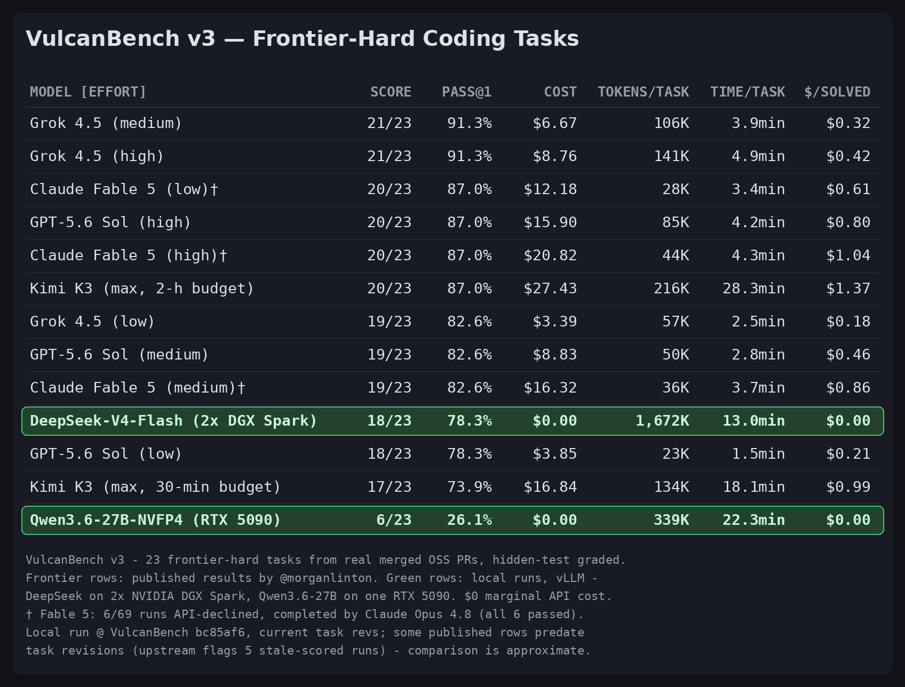

# Benchmark Report: Qwen3.6-27B-NVFP4 on VulcanBench v3 (frontier-hard tier)

**Model:** `nvidia/Qwen3.6-27B-NVFP4` (served as `qwen3.6-27b-nvfp4`)
**Server:** vLLM 0.24.0 in WSL2, RTX 5090 32 GB (475 W cap), MTP n=4, 131K context
**Endpoint:** `http://100.<tailscale-ip-1>:8100/v1` (Tailscale + TCP forwarder)
**Benchmark:** [VulcanBench](https://github.com/morganlinton/VulcanBench) commit `bc85af614051128ed293e13023a4970eab20282e` (`v0.6.0-16-gbc85af6`), v3 suite (23 frontier-hard tasks), `--no-judges`, Docker sandbox on the DGX
**Date:** 2026-07-21
**Companion reports:** [tool-eval-bench (88/100)](../tool-eval/report-msi-qwen3.6-27b-nvfp4-tool-eval.md) · [DSv4-Flash VulcanBench](./report-2x-dgx-spark-deepseek-v4-flash-dspark-vulcanbench.md)

---

## TL;DR

**6/23 (26.1% pass@1), avg_total 0.23.** The frontier-hard tier does exactly
what it says on the tin: it separates frontier-class coding agents from
capable mid-size models. The same model that just posted the *best
tool-calling score of our fleet* (88/100 on tool-eval-bench) collapses on
net-new-algorithm SWE tasks screened to defeat low-effort frontier models.

| MODEL [EFFORT] | SCORE | PASS@1 | TOKENS/TASK | TIME/TASK | $/SOLVED |
|---|---|---|---|---|---|
| Grok 4.5 (medium) | 21/23 | 91.3% | 106K | 3.9min | $0.32 |
| Claude Fable 5 (low)† | 20/23 | 87.0% | 28K | 3.4min | $0.61 |
| Grok 4.5 (low) | 19/23 | 82.6% | 57K | 2.5min | $0.18 |
| **DeepSeek-V4-Flash-DSpark (2x DGX Spark)** | **18/23** | **78.3%** | 1,672K | 13.0min | $0.00 |
| GPT-5.6 Sol (low) | 18/23 | 78.3% | 23K | 1.5min | $0.21 |
| Kimi K3 (max, 30-min budget) | 17/23 | 73.9% | 134K | 18.1min | $0.99 |
| **Qwen3.6-27B-NVFP4 (RTX 5090)** | **6/23** | **26.1%** | 339K | 22.3min | $0.00 |

† Per the upstream v3 report, Fable 5 ran with an Opus 4.8 refusal fallback:
6 of 69 Fable runs (8.7%) were API-declined and completed end-to-end by
Claude Opus 4.8 — all six passed. Fable rows are not pure single-model
results.

**Provenance:** run at VulcanBench `bc85af6`, current `tasks/v3` revisions —
all 23 recorded `task_hash` values in `runs/*/summary.json` verified to match
current task definitions via `harness.tasks.task_hash`. Upstream flags 5
published runs as scored against now-stale task revisions and marks all 23
oss tasks as non-decontaminated, so published-row comparisons are
approximate, not an exact same-revision head-to-head.



## Per-task results

Solved (6): `chi-readfrom-tee-doublecount` (Go), `cobra-noduplicateargs` (Go),
`pflag-uintslice-hex` (Go), `jiff-date-day-lt1` (Rust), `jiff-signdur-panic`
(Rust), `more-itertools-interleave-empty` (Python).

| Task | Result | Steps | Tokens | Time |
|---|---|---|---|---|
| oss-chi-readfrom-tee-doublecount | ✅ | 72 | 116K | 5.5min |
| oss-cobra-noduplicateargs | ✅ | 82 | 250K | 9.3min |
| oss-pflag-uintslice-hex | ✅ | 60 | 134K | 7.7min |
| oss-jiff-date-day-lt1 | ✅ | 120 | 439K | 23.4min |
| oss-jiff-signdur-panic | ✅ | 80 | 102K | 13.4min |
| oss-more-itertools-interleave-empty | ✅ | 50 | 42K | 4.6min |
| oss-flask-teardown-robust | ❌ | 64 | 106K | 20.1min |
| oss-hono-client-header-merge | ❌ | 78 | 276K | 17.8min |
| oss-packaging-range-prerelease-policy | ❌ | 64 | 116K | 20.1min |
| oss-semver-inc-dotted-prerelease | ❌ | 86 | 200K | 20.1min |
| oss-semver-truncate | ❌ | 84 | 187K | 20.1min |
| oss-semver-xrange-order | ❌ | 92 | 315K | 20.1min |
| oss-aiohttp-upgrade-deferred | ❌ | 94 | 373K | 30.1min |
| oss-hono-request-bytes | ❌ | 102 | 492K | 30.1min |
| oss-itertools-strip-prefix | ❌ | 130 | 512K | 30.1min |
| oss-jiff-strftime-negpad | ❌ | 58 | 152K | 30.1min |
| oss-networkx-leiden-communities | ❌ | 259 | 493K | 30.1min |
| oss-pennylane-trotter-fragmented | ❌ | 114 | 133K | 30.1min |
| oss-sqlglot-canonicalize-internal-names | ❌ | 178 | 811K | 30.1min |
| oss-sqlglot-iso8601-nanos | ❌ | 172 | 655K | 30.1min |
| oss-sqlglot-qualify-lateral-star | ❌ | 132 | 672K | 30.1min |
| oss-zod-invert-codec | ❌ | 150 | 732K | 30.1min |
| oss-zod-proto-catchall | ❌ | 122 | 482K | 30.1min |

## Reading the result

- **Go/Rust CLI-and-library tasks were its lane** — 5 of 6 solves, done
  lean (60–120 steps). The solved tasks look like well-specified,
  locally-scoped fixes.
- **All 4 sqlglot tasks, both zod tasks, and the whole semver family
  failed.** Large-repo navigation (sqlglot), TypeScript codec inversion, and
  spec-edge-case reasoning (semver) were beyond it. 11 of 17 failures ran to
  the 30-minute wall; of the rest, five ended at the 20-minute soft budget
  and one (`hono-client-header-merge`) gave out at 17.8min.
- **Scale, not serving, is the differentiator.** Same harness, same sandbox,
  same $0 economics as the DSv4 run — but 27B lands at 26% where the
  671B-class MoE lands at 78%. tool-eval-bench measures *orchestration*
  (picking/chaining tools), where Qwen excels; VulcanBench v3 measures
  *frontier coding depth*, where parameter count still rules.
- **Fleet picture:** Qwen3.6-27B = best cheap tool-caller (88/100
  orchestration, ~85 tok/s); DSv4-Flash stock = the coding agent (18/23
  frontier-hard, clean safety sheet). The pairing is complementary: route
  agentic tool-use to the 5090, hard SWE tasks to the Spark cluster.

## Caveats

- Single repeat; `--no-judges`; human_like unscored.
- Agent traffic crossed Tailscale + a TCP forwarder — adds latency per step
  but no failures were network-caused (no provider errors in the log).
- v3 tasks are post-cutoff for the published frontier rows; cutoff relation
  to Qwen3.6's training data unverified (a stale-knowledge disadvantage is
  possible but would not explain the repo-navigation failures).
- 30-min timeout is VulcanBench's default; a higher cap might convert 1–2 of
  the near-miss failures but would not move the headline.

## Reproduction

```bash
git clone https://github.com/morganlinton/VulcanBench && cd VulcanBench
git checkout bc85af614051128ed293e13023a4970eab20282e  # pinned revision (see provenance note)
make setup && source .venv/bin/activate
# sandbox images: see the DSv4 VulcanBench report for aarch64 + per-task builds
export OPENAI_BASE_URL=http://100.<tailscale-ip-1>:8100/v1 OPENAI_API_KEY=local-dummy
# pricing.local.json: add "openai:qwen3.6-27b-nvfp4": {"input":0,"output":0}
vulcanbench run --suite v3 --model openai:qwen3.6-27b-nvfp4 --no-judges --max-concurrency 3
```

Raw runs (traces, patches, replay HTML) on the DGX at `~/VulcanBench/runs/`.
